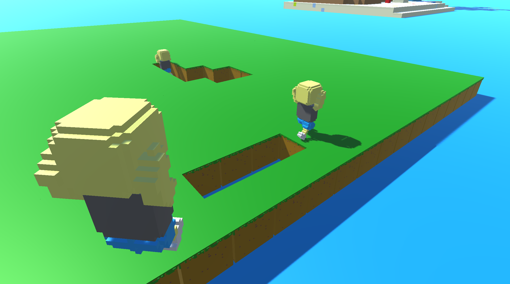
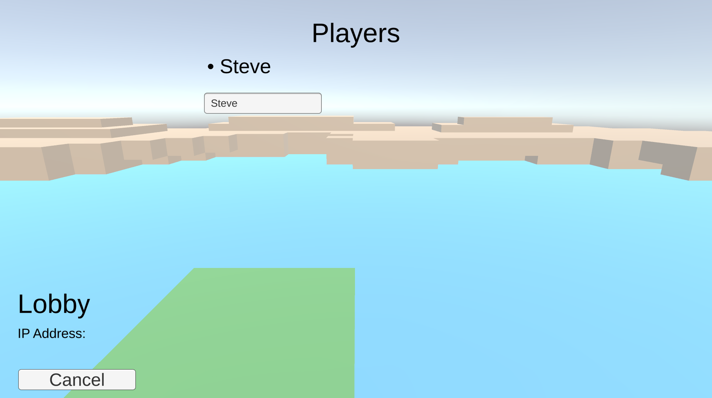
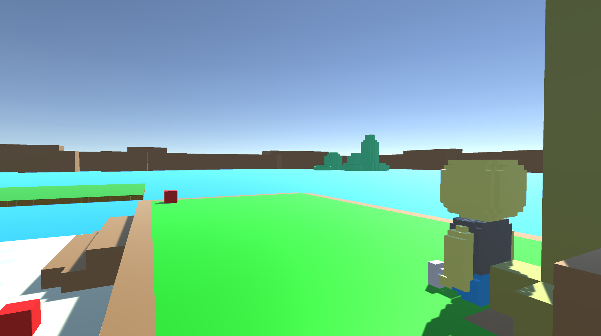

# [Tronpical (Weekly Game Jam - Week 213)](https://asernaio.itch.io/tronpical)

**Welcome to Tronpical! Go! Go! Go!** Run around and try to be the last person standing! **Watch out!** Not only do you have to watch out for the ground below you, but for the other players around you as well. **Be careful!** Stand still for too long, and you'll find yourself "submerged" at the bottom of the ocean... **You can find the link to the submission on** [itch.io - Weekly Game Jam - Week 213](https://itch.io/jam/weekly-game-jam-213/rate/1155994).

## How to Play

Movement: WASD keys

To Jump: the space key

To Look Around: the mouse

## Miscellaneous
Additional Information
* When the game begins, you'll have about a 5 second grace period before the ground below will start to give out.
* Once you fall, you will be able to spectate and fly around the scene.

Credits:
* **Alexis Serna** - Player/UI Programming & Voxel Modeler
  - GitHub: [ASGitH](https://github.com/ASGitH)
  - LinkedIn: [Alexis Serna](https://www.linkedin.com/in/alexisserna)
  - Twitter: [ASGDTweet](https://twitter.com/ASGDTweet)

* **David Warford** - Gameplay/Networking Programmer
  - Email: [davidwarfordgamedev@gmail.com](davidwarfordgamedev@gmail.com)
  - LinkedIn: [David Warford](https://www.linkedin.com/in/davidwarford)

Tools used:
* Game Engine - [Unity Game Engine](https://unity.com)

* Hamachi - [Hamachi](https://vpn.net) (LAN emulator, connect to each other as if you were on a local network, no port forwarding is required.)

* Modeling Software - [MagicaVoxel](https://ephtracy.github.io)

## To Run it

To get it up and running, you'll need to:

* Download the RAR file, extract it, and run the executable (.exe).

## To Set Up an Online "LAN" Server
An additional tool is needed to set up the server. The link to the software (**Hamachi**) is provided above in the **Miscellaneous - Tools Used Section**. 

Once installed, the next steps are as followed:
1. Log-in/Sign-up into your respective account
2. Click on the power icon to be able to create/join a network
3. Go to the Network tab and follow the steps below to create/join a network

- To Create a Network
1. Set up a **Network ID**
2. Create then confirm the **Password**

- To Join a Netwwork
1. Enter the **Network ID**
2. Enter the **Password**

Below the power icon you should now see a new network, moving over to **Unity**:
- If Hosting
1. Nothing to much to worry over in the host's end, the people joining however will have some additional tasks ahead of them.

- If Joining
1. In **Hamachi** you will need to grab the **host's IP address**, right click on the host, and then select **Copy IPv4 Address**.
2. Afterwards, in **Unity** go to the **IP Address** InputField, and paste the IP address there. Click on the connect button and you will now be in the same lobby as the host.

